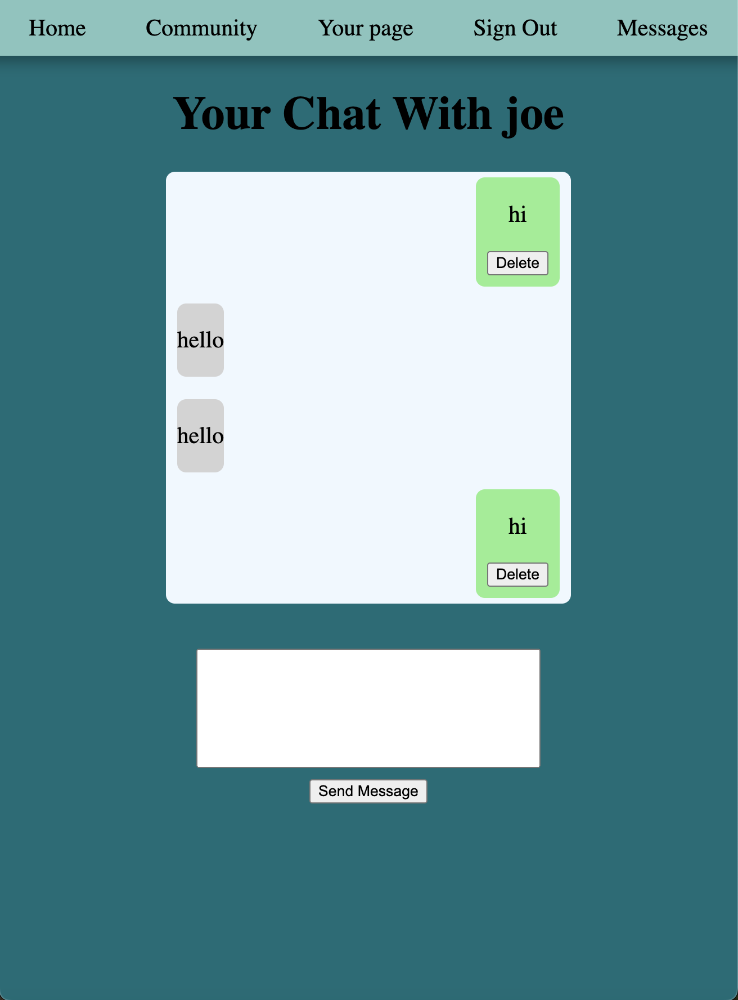
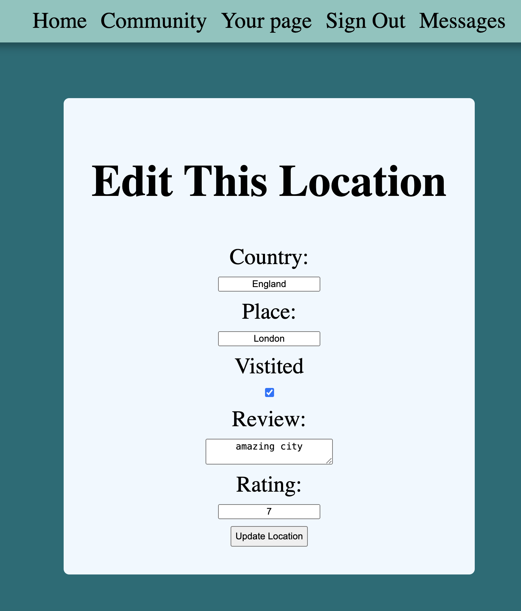
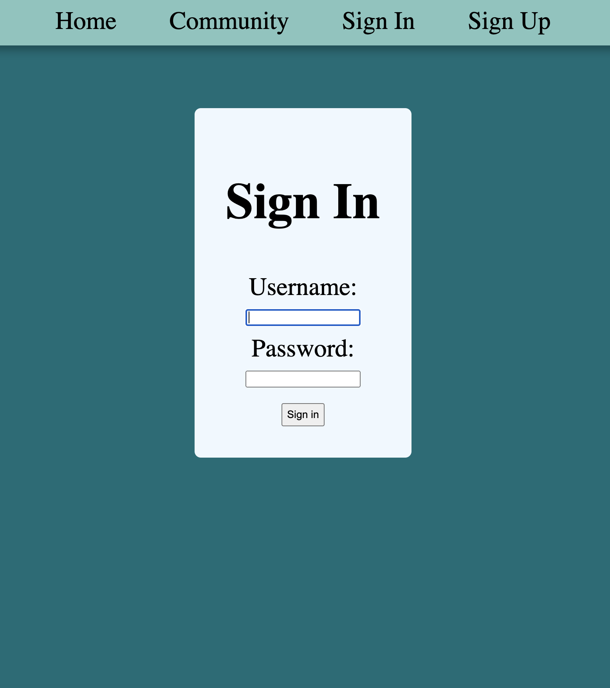
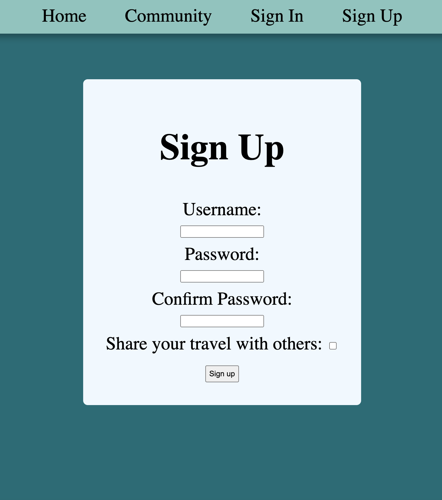

# Travel Log Ga Project 2











## Description
This is currently the beginning of a CRUD API built using a Men stack. The reason I created this project was for my love of travelling the world <br>and therefore its features allow people to store a list of travel destinations with information about each place they have been to or dream of going to.<br>  After this Users can message each other to allow people to organise trips or talk about destinations they have been to so that others have to share the best travel advice. 


## Getting Started

the current model for travel could be changed to involve a 
so the information is organised in a better format.  
```js 
createdBy: { type: mongoose.Schema.ObjectId, required: true, ref: "User" },
```

```js 
const mongoose = require('mongoose')

const TravelSchema = new mongoose.Schema({ 
    country: { type: String, required: true },
    place: { type: String, required: true },
     hasBeen: { type: Boolean, required: true},
     review: { type: String, required: false},
     rating: { type: Number, required: false},
});

const UserSchema = new mongoose.Schema({
    username: { type: String, required: true },
    password: { type: String, required: true },
     shareYourTravel: { type: Boolean, required: true},
     destination: [TravelSchema],
}); 

const User = mongoose.model('User', UserSchema)

module.exports = User;

```

get request for conversations .toString() help compare the mongoose schema objectId with existing ones that were strings. 
```js
router.get('/:userId/message/:sessionId', async (req, res) => {
    if (req.session.user) {
        try {
            const conversations = await Conversation.find()

            const targetId = req.params.userId

            let usersConvos = []
            conversations.forEach(convo => {
                if (convo.userIdOne.toString() === req.session.user._id && convo.userIdTwo.toString() === targetId ||
                    convo.userIdTwo.toString() === req.session.user._id && convo.userIdOne.toString() === targetId
                ) {
                    usersConvos.push(convo)
                }
            });
            if (usersConvos.length === 0) {
                req.body.userIdOne = req.params.userId
                req.body.userIdTwo = req.session.user._id
                const newConvo = await Conversation.create(req.body)

                res.redirect(`/community/conversation/${newConvo._id}`)
            } else {
                res.redirect(`/community/conversation/${usersConvos[0]._id}`)

            }
        } catch (error) {
            res.render('error/error.ejs', {
                errorMessage: error.message,
            });
        }

    } else {
        res.redirect('/auth/sign-in')
    }
})
```

### Deployed App

[Link to deployed app](https://travel-log-ga-project.netlify.app/)


## Attributions


- [color schemes ](https://color.adobe.com/create/color-wheel)
- [images were obtained from](https://unsplash.com/)

## Technologies Used

- JavaScript
- ejs
- CSS
- HTML

dependencies 
---
- Node.js
- Express
- MongoDB
- mongoose
- bcrypt
- morgan
- dotenv
- express-session
- method-overide 

## Next Steps
In the future, more customisability for each individual's show page is a priority as well as allowing them to rank their destinations and be able to group with people<br>
who have a similar destination this will involve creating a new scheme to hold data on different countries that will be embedded in the current destination schema so filtering for country and or city will be possible.

``` js
const TravelSchema = new mongoose.Schema({ 
    country: { type: String, required: true }, // create an enbeded list that users can pick from
    place: { type: String, required: true },
     hasBeen: { type: Boolean, required: true},
     review: { type: String, required: false},
     rating: { type: Number, required: false},
}); 
```